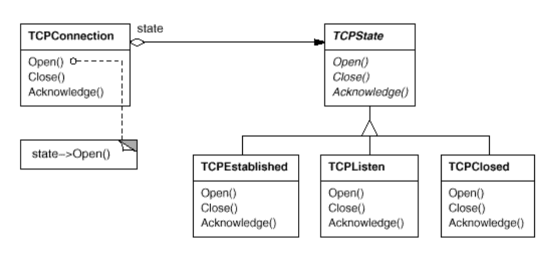
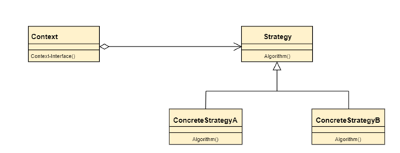
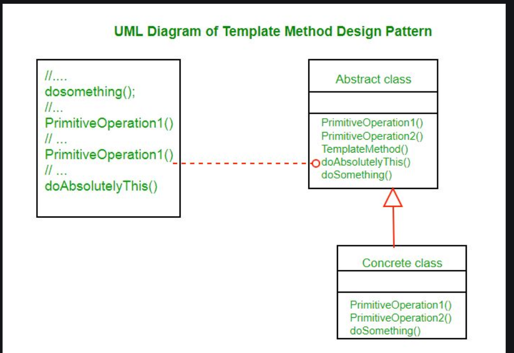

# Design Patterns

## Structural Patterns


<hr/>

## Behaviour Patterns

### Memento Pattern

Memento - Implementation and Testing below showcasing the restore/undo functionality

```var editor = new Editor(); // to create a state and add it to history
var history = new History(); // state history - with a stack

editor.setContent("a"); // make new content
history.push(editor.createState()); // add it to history

editor.setContent("b");
history.push(editor.createState());

editor.setContent("c"); // at the moment
history.push(editor.createState());

editor.setContent("d"); // at the moment
history.push(editor.createState());

editor.restore(history.pop()); // restore - still encapsulated
System.out.println(editor.getContent());

editor.restore(history.pop());
System.out.println(editor.getContent());

editor.restore(history.pop());
System.out.println(editor.getContent());

editor.restore(history.pop());
System.out.println(editor.getContent());
```

### State Pattern

State Design Pattern - Using the Tool interface, different tool types implementing the interface
are created when set a new tool on the canvas. The mouseup and mousedown functions
don't need to setup separately in a switch case or an if and else case

#### Example 1 - Canvas


```var canvas = new Canvas();
canvas.setCurrentTool(new SelectionTool()); // an object that implements the interface (Selection or Brush)
canvas.mouseDown();
canvas.mouseUp();

canvas.setCurrentTool(new BrushTool());
canvas.mouseUp();
canvas.mouseDown();

canvas.setCurrentTool(new EraserTool());
canvas.mouseDown();
canvas.mouseUp();
```

#### Example 2 



Showcasing how the state pattern can be applied to a TCP Connection class to have 3 different behaviours such 
established, listen and closed using an abstract class here. 


### Strategy Pattern 

This is a behaviour design pattern that allows the behaviour of an object to be selected at runtime. It is one of 
the GoF design patterns, which are widely used in object-oriented programming. The pattern consists of three main components 
:the Context, Strategy and Concrete Strategy. The context is the class that contains the object whose behaviour needs to 
be changed dynamically. The strategy is the interface or abstract class that defines the common methods for all algorithms 
that can be used by the Context object. The Concrete Strategy is the class that implements the Strategy interface and  
provides the actual implementation of the algorithm. 

**Intent**
Define a family of algorithms, encapsulate each one, and make them interchangeable. Strategy lets the algorithm vary 
independently from clients that use it. 

**Applicability** (When to use the pattern)

- Many related classes differ only in their behaviour. Strategies provide a way to configure a class with one of many behaviours. 
- Requirement is to have different variants of algorithm. Can be implemented as a hierarchy of algorithms
- an algo uses data that clients shouldn't know about. Use strategy  pattern to avoid exposing  complex, algo specific data structure.
- a class defines many behaviours, and these appear as multiple conditional statements in its operations. Instead of many 
conditionals, move related conditional branches into their own Strategy class.




### Template Method 

Template method uses a parent class to create an algorithm as a skeleton of operations and leave the details to be implemented 
by the child classes. The overall structure and sequence of the algorithm are preserved by the parent class. 

An example is a Preset HTML template which has a fixed preset format. 

Implementation: This design pattern is used popularly in framework development. This helps to avoid code duplication also. 



- Abstract Class: This class cannot be overridden by any other classes except for the abstract methods defined by the programmer.
Therefore, the overridden abstract methods for concrete classes extending them creates an easy template for the programmer 
to not duplicate code and implement the same methods over and over again. 
- Many concrete classes can be made from this abstract class. Overall it is an easy desing pattern to implement for decoupling 
the parent class from child class.

## Creational Patterns 

### Builder Pattern 

The builder pattern abstracts creation of new objects without having to fill in all the fields of an object. Here for 
example the car has multiple fields but I can use the CarBuilder class to build a Car object with any field I like. Using 
the multiple construct methods. This gives me the flexibility to create Car objects however I want to create them. Whether 
its just the car model or just with the colour and car brand.

```
Car car = new CarBuilder().id(10).color("Blue").build();
System.out.println(car.toString());

CarBuilder builder = new CarBuilder();
builder.brand("Mazda").engine("V8").color("Black");

Car secondCar = builder.build();
System.out.println(secondCar.toString());
```

### Prototype Pattern 

Specify the kinds of objects to create using a prototypical instance, and create new objects by copying the prototype. 
Basically the point is to copy an existing object rather than create a new instance from scratch, something that may 
include costly operations. The existing object acts as a prototype and contains the state of the object. The newly 
copied object may change same properties only if required. This approach saves costly resources and time, especially when
object creation is a heavy process. 

**When to use the Prototype Design Pattern**

When a system should be independent of how its product are created, composed and represented 
When the classes to instantiate are specified at run-time   

### Factory Pattern
<hr/>

### Abstract Factory Pattern

<hr/>

